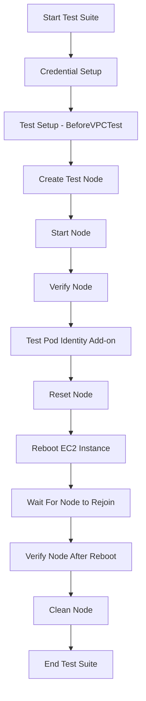
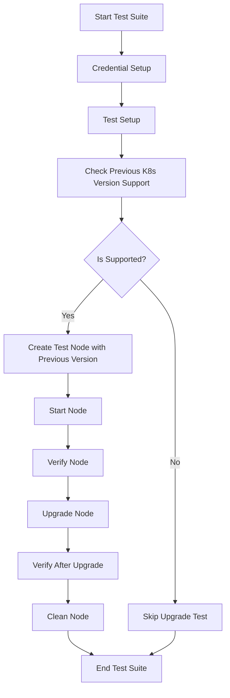
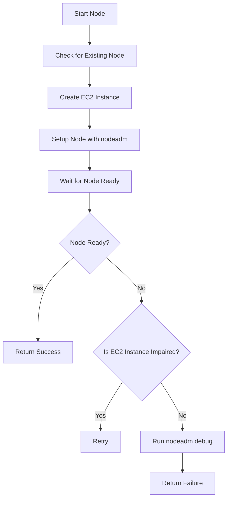
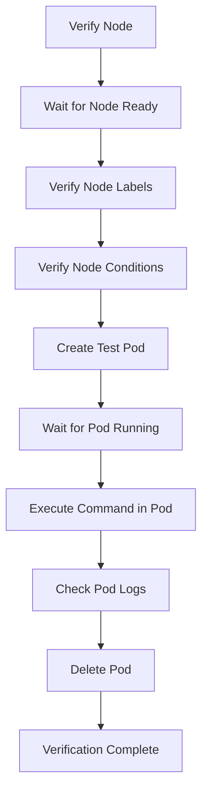
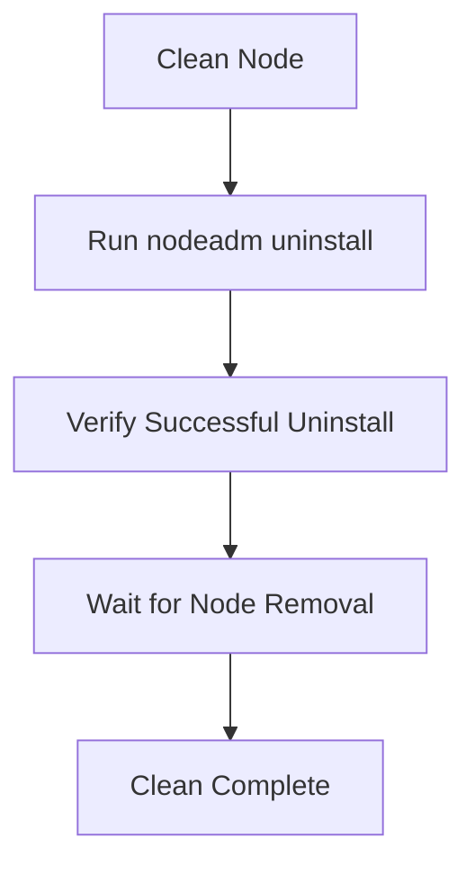

# EKS Hybrid Test Documentation

This document provides comprehensive information about the EKS Hybrid test framework, including test flows, setup, execution, debugging, and configuration.

## Table of Contents

1. [Test Architecture Overview](#test-architecture-overview)
2. [Test Setup](#test-setup)
3. [Test Flows](#test-flows)
4. [Test Execution](#test-execution)
5. [Debugging Tests](#debugging-tests)
6. [Test Code Structure](#test-code-structure)
7. [Test Configuration](#test-configuration)
8. [Integration Tests vs Canaries](#integration-tests-vs-canaries)

## Test Architecture Overview

The EKS Hybrid tests validate the functionality of nodeadm in connecting nodes to EKS clusters. The test suite is built using the Ginkgo framework and follows a structured approach to ensure comprehensive coverage across different operating systems, credential providers, and scenarios.

### Key Components

- **TestNode**: Orchestrates the node lifecycle (creation, verification, cleanup)
- **PeerdNode**: Handles EC2 instance provisioning and management
- **VerifyNode**: Validates node functionality within the Kubernetes cluster
- **CleanNode**: Manages the uninstallation process
- **UpgradeNode**: Handles the node upgrade procedure

### Main Test Flows

1. **Initialization Flow**: Tests a fresh node joining a cluster
2. **Upgrade Flow**: Tests upgrading a node from a previous Kubernetes version
3. **Reboot Flow**: Tests node rejoin functionality after reboot

## Test Setup

The test setup involves several key steps that prepare the environment for testing:

### 1. Credential Setup (`BeforeSuiteCredentialSetup`)

- Reads test configuration from the specified file
- Sets up AWS credentials and configurations
- Creates necessary infrastructure resources via CloudFormation
- Prepares SSH keys and role configurations
- Returns a `SuiteConfiguration` object with all required settings

### 2. Configuration Unmarshalling (`BeforeSuiteCredentialUnmarshal`)

- Unmarshals the `SuiteConfiguration` from YAML/JSON
- Makes the configuration available to all test processes

### 3. VPC Test Setup (`BeforeVPCTest`)

- Builds a `PeeredVPCTest` configuration using the suite configuration
- Sets up AWS clients (EC2, EKS, SSM, IAM, S3, etc.)
- Configures Kubernetes client connections
- Initializes logging and resource management components
- Configures credential providers for different authentication methods

### 4. OS and Credential Provider Matrix

- Creates a matrix of operating systems and credential providers to test
- Filters out unsupported combinations
- Prepares for parameterized testing across the matrix

## Test Flows

### Initialization Flow



#### Key Steps:

1. **Node Creation**: Creates an EC2 instance with appropriate userdata
2. **Node Start**: Installs nodeadm and waits for node to join the cluster
3. **Node Verification**: Validates node labels, conditions, pod scheduling, and networking
4. **Pod Identity Add-on Testing**: Verifies the Pod Identity add-on functionality
5. **Node Reset**: Tests clean uninstall using `nodeadm uninstall`
6. **Reboot Testing**: Verifies node rejoins cluster after reboot
7. **Final Verification**: Ensures node functionality after rejoin
8. **Cleanup**: Performs final uninstallation and resource cleanup

### Upgrade Flow



#### Key Steps:

1. **Version Support Check**: Verifies if previous Kubernetes version is supported
2. **Node Creation with Previous Version**: Creates EC2 instance with previous K8s version
3. **Node Start & Verification**: Same as initialization flow
4. **Upgrade Procedure**: Runs `nodeadm upgrade`
5. **Post-upgrade Verification**: Verifies node functionality after upgrade
6. **Cleanup**: Performs uninstallation and resource cleanup

### Node Start Flow



### Node Verification Flow



### Clean Node Flow



## Test Execution

The test execution follows a specific order of steps that ensure comprehensive testing of nodeadm functionality:

### 1. Suite Setup Phase

- Reads configuration from files
- Sets up credentials and infrastructure
- Prepares for testing across multiple processes

### 2. Per-Test Setup Phase

- Configures VPC and network resources
- Creates a matrix of OS/credential provider combinations
- Sets up AWS and Kubernetes clients

### 3. Test Execution Phase

- For each OS and credential provider combination:
  - Initialization flow testing
  - Upgrade flow testing (if supported)

### 4. Cleanup Phase

- Collects logs
- Uninstalls nodeadm from nodes
- Removes EC2 instances
- Cleans up any leftover resources
- Optionally skips cleanup if `SKIP_CLEANUP=true` is set

### Order of Steps in a Typical Test

1. **BeforeSuite**: Setup credentials and infrastructure
2. **BeforeEach**: Configure test environment
3. **Test Execution**:
   - Create EC2 instance
   - Install nodeadm
   - Wait for node to join
   - Verify node functionality
   - Test pod scheduling and execution
   - Test add-ons (like Pod Identity)
   - Uninstall nodeadm
   - Test reboot capability (for init flow)
   - Verify functionality after reboot (for init flow)
   - Upgrade nodeadm (for upgrade flow)
   - Verify functionality after upgrade (for upgrade flow)
   - Final cleanup
4. **AfterEach**: Clean up test resources
5. **AfterSuite**: Clean up infrastructure (if not skipped)

## Debugging Tests

Debugging the EKS Hybrid tests involves understanding common failure points and knowing where to look for relevant logs.

### Common Failure Points

1. **EC2 Instance Creation**
   - Node fails to launch or become running
   - Hardware issues with EC2 instance (impaired instance)

2. **nodeadm Installation/Joining**
   - Node fails to connect to the EKS cluster
   - Kubelet fails to start
   - CNI issues
   - Authentication/credential problems

3. **Node Verification**
   - Node labels or conditions are incorrect
   - Pods fail to schedule or run
   - Network connectivity issues

4. **Uninstall/Cleanup Issues**
   - Node remains in the cluster after uninstall
   - Resources not properly cleaned up

5. **Upgrade Issues**
   - Compatibility problems between versions
   - Failed upgrade process

### What Logs to Look For

#### Environment Failure vs. nodeadm Failure vs. Test Failure

##### Environment Failures:
- **AWS API errors**: Check test logs for AWS API errors
- **EC2 instance impairment**: Look for "isImpaired" checks in logs
- **Network connectivity**: Review VPC/subnet/security group logs

##### nodeadm Failures:
- **Installation errors**: Check nodeadm install output
- **Joining errors**: Check kubelet logs and nodeadm logs
- **Authentication issues**: Check AWS credential logs and credential provider logs
- **Runtime errors**: Check containerd logs

##### Test Framework Failures:
- **Test execution errors**: Check Ginkgo test output
- **Invalid assertions**: Check Ginkgo expectation failures
- **Timeouts**: Look for timeout errors in wait operations

### Where to Look for Logs

#### For Environment Failures:
- **CloudWatch Logs**: For AWS service logs
- **EC2 Console**: For EC2 instance status and impairment
- **Test artifacts directory**: For test-specific AWS logs
- **S3 bucket**: For collected environment logs

#### For nodeadm Failures:
- **Serial console output**: For boot and early installation issues
- **nodeadm debug output**: For detailed nodeadm diagnostics
- **System logs**: For OS-level issues (/var/log/syslog, journald logs)
- **Kubelet logs**: For node joining and operation issues
- **containerd logs**: For container runtime issues

#### For Test Failures:
- **Ginkgo test output**: For test execution flow and assertions
- **Test artifacts**: For detailed test logs
- **S3 bucket**: For collected test artifacts
- **Test runner logs**: For overall test execution

### Debugging Commands Used by the Test Framework

The test framework includes several debugging mechanisms:

1. **nodeadm debug**: Collects diagnostic information from the node
   ```
   nodeadm debug
   ```

2. **Serial console access**: Captures boot-time and installation logs
   ```go
   peered.NewSerialOutputBlockBestEffort(ctx, &peered.SerialOutputConfig{...})
   ```

3. **Log collection**: Collects and uploads logs to S3
   ```go
   peeredNode.Cleanup(ctx, node)
   ```

4. **Impaired instance detection**: Checks if an EC2 instance is having hardware issues
   ```go
   ec2.IsEC2InstanceImpaired(ctx, ec2Client, instanceID)
   ```

## Test Code Structure

The test code is structured around the Ginkgo testing framework with several key components:

### Core Test Components

1. **TestNode** (`test/e2e/suite/test_node.go`)
   - Manages the node lifecycle
   - Handles node startup, verification, and monitoring
   - Integrates with EC2 instance creation and management

2. **PeerdNode** (`test/e2e/peered/node.go`)
   - Creates and manages EC2 instances
   - Configures instance userdata
   - Handles log collection and cleanup

3. **VerifyNode** (`test/e2e/kubernetes/verify.go`)
   - Verifies node functionality within Kubernetes
   - Runs pod tests to validate scheduling and execution
   - Checks node labels and conditions

4. **PeeredVPCTest** (`test/e2e/suite/peered_vpc.go`)
   - Main test orchestrator
   - Configures AWS and Kubernetes clients
   - Creates nodes with different OS/credential combinations

5. **nodeadm_test.go** (`test/e2e/suite/nodeadm/nodeadm_test.go`)
   - Contains the Ginkgo test suite definition
   - Defines the test flows (init, upgrade)
   - Sets up the test environment

### Important Test Files

- `test/e2e/suite/nodeadm/nodeadm_test.go`: Main test suite
- `test/e2e/suite/test_node.go`: Test node management
- `test/e2e/suite/peered_vpc.go`: VPC test configuration
- `test/e2e/peered/node.go`: EC2 instance management
- `test/e2e/kubernetes/verify.go`: Node verification
- `test/e2e/kubernetes/node.go`: Kubernetes node operations
- `test/e2e/ec2/instance.go`: EC2 instance operations
- `test/e2e/nodeadm/`: nodeadm-specific operations

### Helper Functions and Utilities

- `SynchronizedBeforeSuite`: Sets up the test environment once
- `BeforeEach`: Prepares for individual test cases
- `DescribeTable`: Enables parameterized testing across OS/provider matrix
- `OSProviderList`: Builds the OS and credential provider matrix
- `NodeTimeout`: Manages timeouts for node operations

## Test Configuration

### High-Level Ginkgo Configuration

The EKS Hybrid tests use Ginkgo for test organization and execution:

1. **Test Suite Definition**:
   ```go
   var _ = Describe("Hybrid Nodes", func() {
       When("using peered VPC", func() {
           // Test contexts and cases
       })
   })
   ```

2. **Setup and Teardown**:
   ```go
   var _ = SynchronizedBeforeSuite(
       // Setup code that runs once
       func(ctx context.Context) []byte {
           // Initialize environment
           return configData
       },
       // Setup code that runs on all processes
       func(ctx context.Context, data []byte) {
           // Process configuration
       },
   )
   ```

3. **Parameterized Testing**:
   ```go
   DescribeTable("Joining a node",
       func(ctx context.Context, nodeOS e2e.NodeadmOS, provider e2e.NodeadmCredentialsProvider) {
           // Test code
       },
       entries,
   )
   ```

4. **Test Case Structure**:
   ```go
   BeforeEach(func(ctx context.Context) {
       // Setup for each test case
   })
   
   It("does something", func() {
       // Test assertions
   })
   
   AfterEach(func() {
       // Cleanup after each test case
   })
   ```

### Configuration Files and Parameters

The test framework uses several configuration sources:

1. **Command-Line Flags**:
   - `--filepath`: Path to the test configuration file

2. **Environment Variables**:
   - `SKIP_CLEANUP`: Skip cleaning up resources after tests
   - `RHEL_USERNAME` and `RHEL_PASSWORD`: For RHEL OS testing

3. **Configuration File**:
   - Contains cluster settings
   - AWS region configuration
   - Logging settings
   - Node configuration options

4. **Infrastructure Setup**:
   - CloudFormation templates
   - AWS resource configurations
   - Networking and security settings

## Integration Tests vs Canaries

The EKS Hybrid testing includes both integration tests and canary tests, which serve different purposes but share common components.

### Integration Tests

Integration tests are comprehensive tests that validate the full functionality of nodeadm across different operating systems, credential providers, and scenarios.

**Characteristics**:
- Run as part of CI/CD pipelines
- Cover multiple OS and credential provider combinations
- Test both initialization and upgrade flows
- Validate all nodeadm features and add-ons

**Components**:
- Full test suite with all test cases
- Comprehensive OS/provider matrix
- All verification steps

### Canary Tests

Canary tests are lightweight tests that continuously validate the core functionality of nodeadm in production environments. They reuse components from the integration test framework but focus on critical paths.

**Characteristics**:
- Run periodically in production environments
- Focus on key functionality (node joining, basic operations)
- Limited OS/provider combinations
- Detect regressions and environmental issues

**How Canaries Reuse the nodeadm Test**:
- Use the same `TestNode`, `PeerdNode`, and `VerifyNode` components
- Simplified test flow focusing on critical paths
- May skip extensive testing of features like add-ons
- Share the same verification logic and assertions

**Key Differences**:
- Integration tests are more comprehensive and run in CI/CD
- Canaries are more focused and run continuously in production
- Integration tests validate changes before release
- Canaries validate the ongoing health of the system

### Shared Components

Both integration tests and canaries share:
1. Core node lifecycle management
2. AWS resource provisioning logic
3. Kubernetes verification procedures
4. Error detection and recovery mechanisms
5. Log collection and diagnostics

This shared codebase ensures consistency between integration testing and production monitoring while allowing each to serve its specific purpose.
